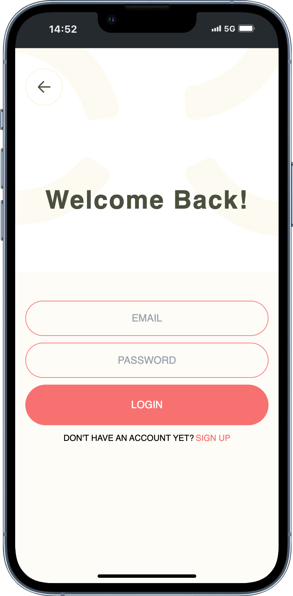
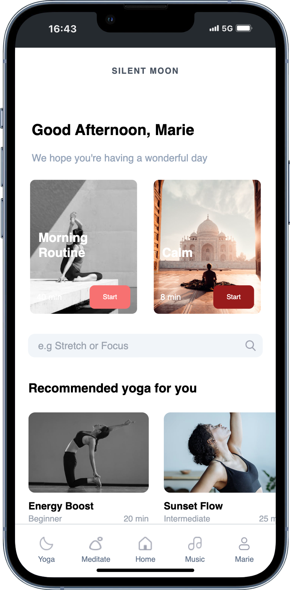
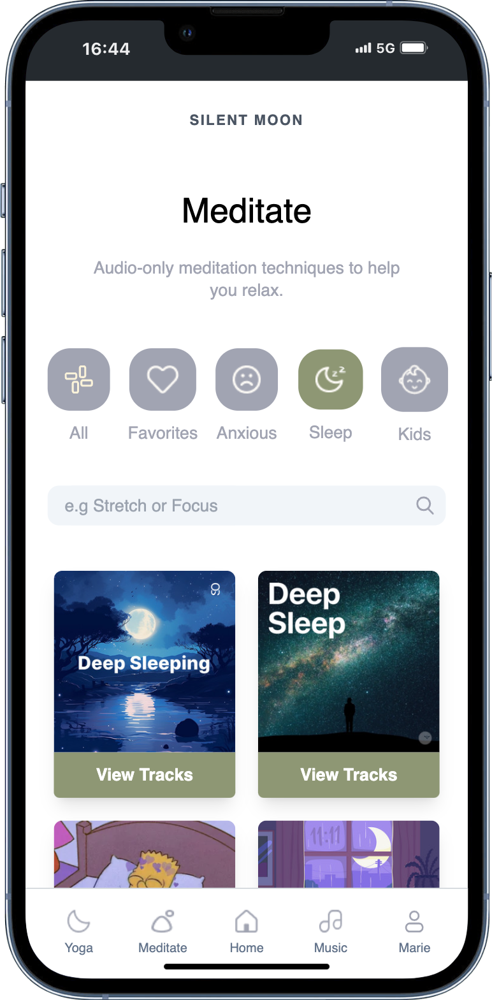
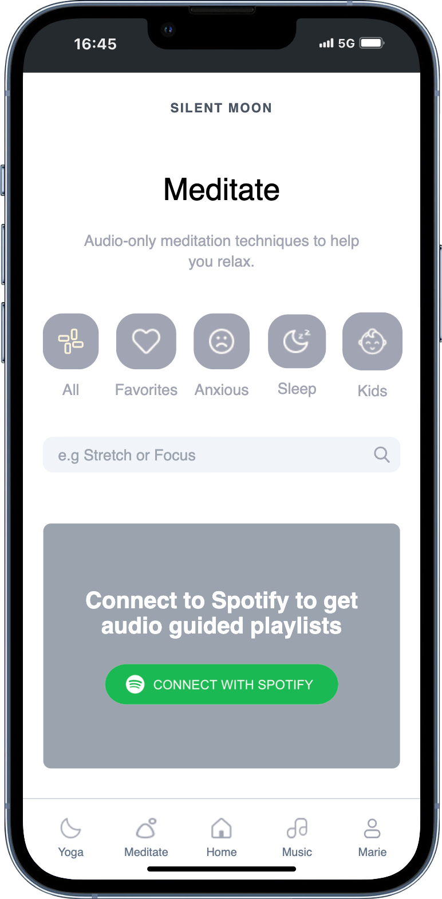
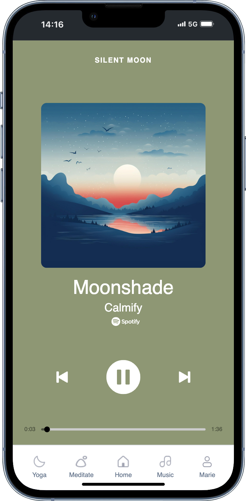

project by [Tolgapp](https://tolgapp.de) 

# SILENTMOON - Frontend created with React, TypeScript, Vite & TailwindCSS
# Backend created with NodeJS, Express, MongoDB, Mongoose + Spotify API 

<div style="display: flex; justify-content: center; align-items: center; gap: 1rem; flex-wrap: wrap; width: 90%; margin-top: 4rem">
  
  
  
  
  
  
</div>

## Getting Started
1. Clone the repository
2. Install dependencies:
   ```bash
   npm install
   ```
3. Start the development server:
   ```bash
   npm run dev
   ```
4. Open [http://localhost:5173](http://localhost:5173) in your browser


## Live Demo
👉 [Live Demo](https://silentmoon.vercel.app)


## Usage
1. Sign up with a random email and password and login with these data
2. If available you can login with your spotify account and listen to selected yoga and meditation playlists. 
3. Enjoy and get relaxed!

## Needed Extensions / Settings
<section  style="display: flex; flex-direction: column; justify-content: center; align-items: center; padding: 0 3rem; margin-top: 4rem">
    <h3>For best experience use Chrome Dev Tools and change it to mobile view to iPhone 12 PRO (optimized for iPhone 12/13/14 PRO)</h3>
    <h3>or download the Mobile Simulator from Chrome web store: https://shorturl.at/H0o0w</h3>
</section>