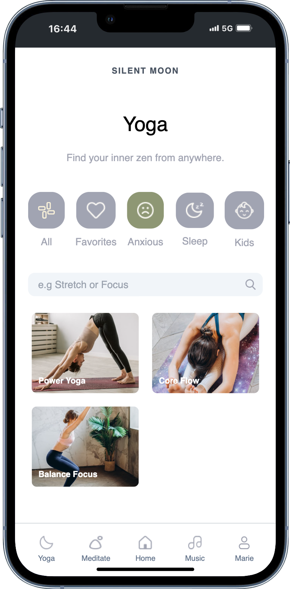

# SILENTMOON - Frontend created with React, TypeScript, Vite & TailwindCSS 
# Backend created with NodeJS, Express, MongoDB, Mongoose + Spotify API 

  
  
  
  
  
  

<section  style="display: flex; flex-direction: column; justify-content: center; align-items: center; padding: 0 3rem; margin-top: 4rem">
    <h3>For the best experience use Chrome Dev Tools and change it to mobile view to iPhone 12 PRO (optimized for iPhone 12/13/14 PRO)</h3>
    <h3>or download the Mobile Simulator from Chrome web store: https://shorturl.at/H0o0w</h3>
</section>